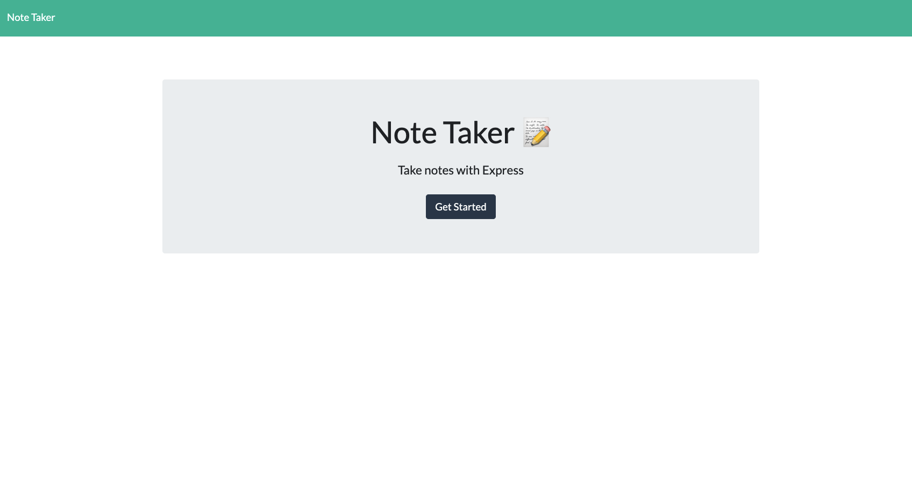
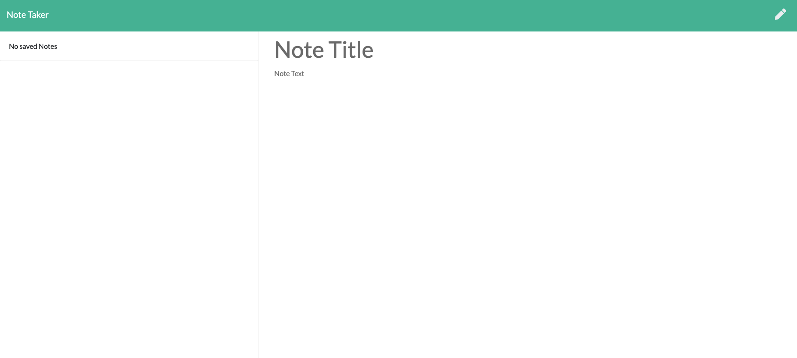
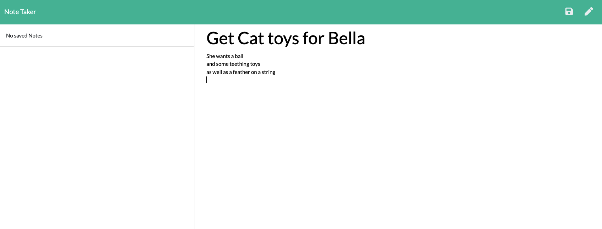
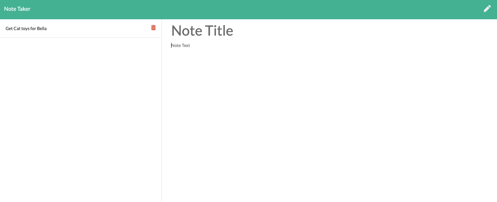

# 11 Express.js: Note Taker

# Description 
 An application that can be used to write, save and delete notes.  This application uses an express backend to save and retrieve note data from a JSON file.

# Instructions
To start the application, simply type in console: npm start  
Then, navigate to the address that appears in the console

# Table of Contents

1. [Description](#Description)
2. [Features](#Features)
3. [License](#License)
4. [Contributions](#Contributions)
5. [Information](#Information)
6. [Usage](#Usage)

## Features
- localhost
- heroku
- JSON
- npm i
- Express.js
- Node.js

# License

## This application is covered by the MIT license. 

# Contributions 
Sultan Siddiqi

# Information
## GitHub User name 
sultansiddiqi
### Link to GitHub:
https://github.com/sultansiddiqi/Challenge-011-Express.js-Challenge-Note-Taker

### To access the website via Heroku
https://ss-note-taker.herokuapp.com/

### Email address 
sultan.siddiqi@gmail.com

# Usage

